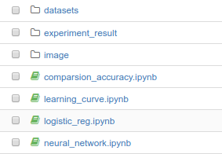
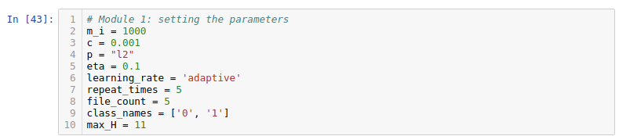
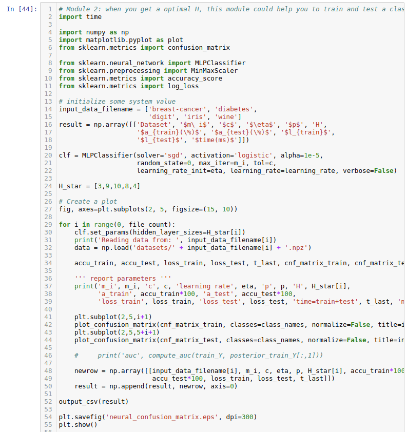
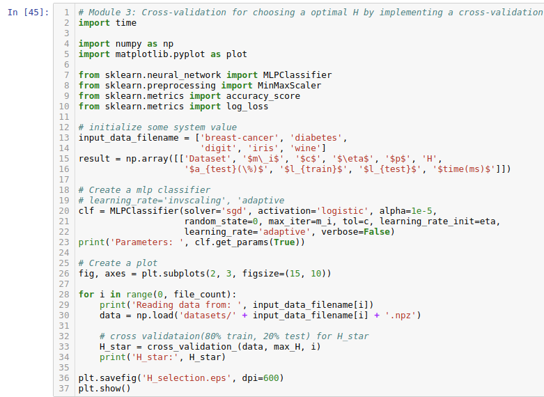
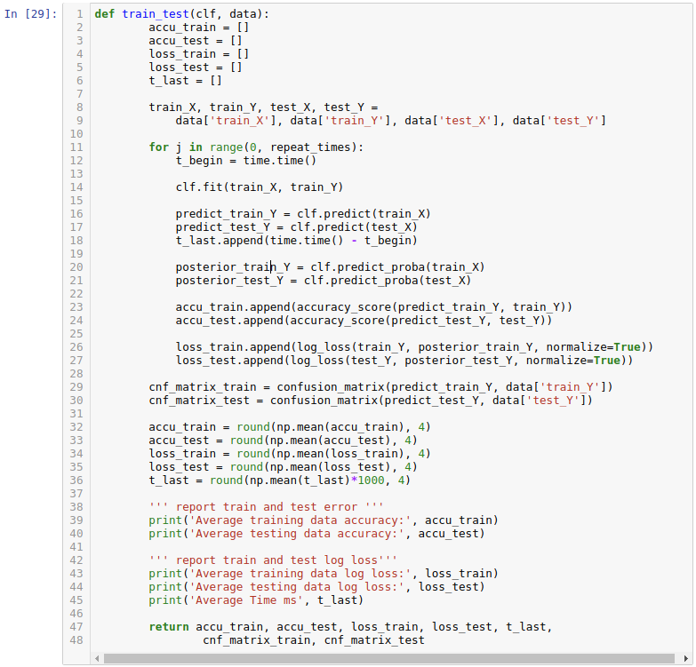
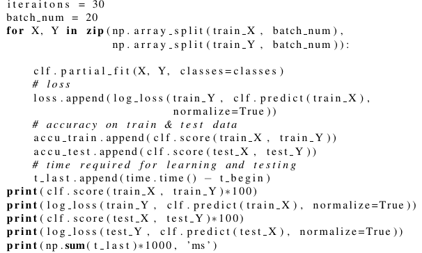
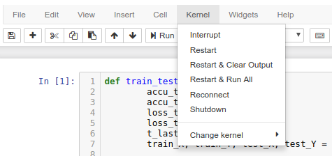
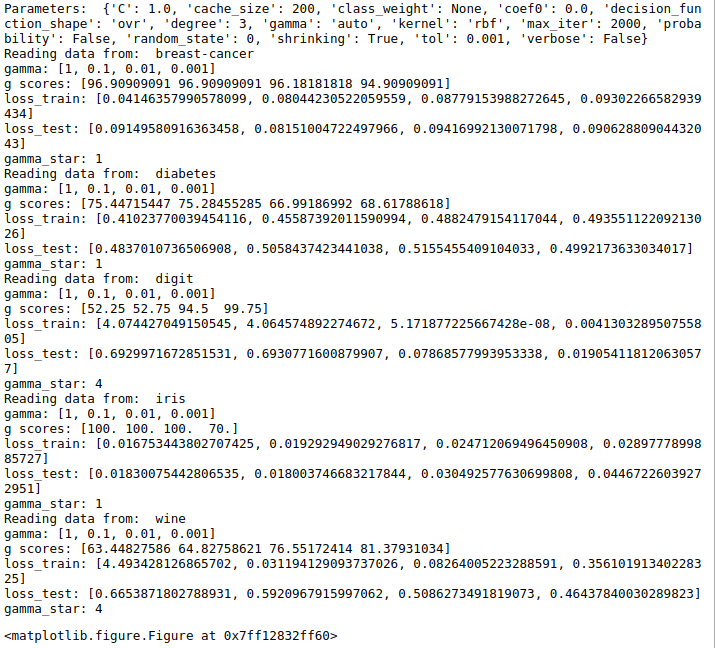

# COMP5212 Machine Learning Project 1
## Requirement
1. Anaconda
2. jupyter notebook
> http://jupyter.readthedocs.io/en/latest/install.html

## How to use
1. File structure 
> 
2. There are three main modules for this projects: logistic_reg.ipynb, neural network.ipynb, svm.ipynb, while comparsion_accuracy.ipynb is for drawing comparsion curves between the four models. All operations like building classificer, training and testing are wrote in the three main files with same code structure.
    - neural_network.ipynb
        1. Module 1: Setting the parameters
        > 
        2. Module 2: When you get a optimal H, this module could help you to **train and test a classifier**.
        > 
        3. Module 3: **Cross-validation for choosing a optimal H** by implementing a cross-validation
        > 
        4. Other modules: Defining some functions
        >      
    - svm.ipynb
        1. Module 1: Setting the parameters
        2. Module 2: When you get a optimal gamma, this module could help you to **train and test a classifier**.
        3. Module 3: **Cross-validation for choosing a optimal gamma** by implementing a cross-validation
        4. Other modules: Defining some functions.
    - logistic_reg.ipynb
        1. Module 1: Setting the parameters
        2. Module 2: This module could help you to **train and test a classifier**
        3. Module 3: measuring model's performance overtimes 
        > 
        4. Other modules: Defining some functions 
    - Notes
        1. Different from neural_network.ipynb and svm.ipynb, logistic_reg.ipynb does not have the **cross-validation module**, but have a **performance measurement module**. 

### Resulting
1. If you need to verify my result, **please choose any ipynb file, and select Kernel -> Restart & Run All, all the modules in this file will run automatically in order.** You can check my output of the module 2 and module 3.
> 
2. When you run the code successfully, you could see the result directly like this:
> 

### Contact
1. If you do not about jupyter, or meet some problems about running it, please feel free to contact me: jjiao@ust.hk.

